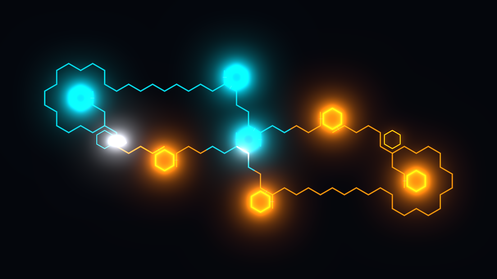

# Gridlock

A dark hexagonal lattice strung with glowing wires. You own one node, an AI owns
another. Charge accumulates in the nodes you hold and you drag it along wires to
take more. The wires zigzag, so a node that looks adjacent may be six seconds
away, and beams that meet fight *on the wire* — the contact point shoving back
and forth like a tug of war made of light.

Built from `docs/GRIDLOCK_SPEC.md`.



## Layout

```
Core/            the whole game: plain C#, zero engine dependencies
Core.Tests/      91 tests, xunit
Tools/Headless/  the measurement tool - every claim below comes from it
Tools/shoot.ps1  capture and measure a rendered frame
Levels/          7 hand-authored boards (JSON)
GodotProject/    Godot 4.7 presentation layer  (see its README)
UnityProject/    Unity 6 presentation layer    (see its README)
tasks/           todo.md with the measured review, lessons.md
```

`Core` is shared verbatim: Godot compiles it from source, Unity consumes it as a
local package. It is deterministic, fixed-timestep at 1/60 s, contains no
randomness of its own, and never touches rendering, input, or the filesystem.

## Build and run

```powershell
# The machine PATH has dotnet but spawned shells can carry a stale one.
$env:PATH = "C:\Program Files\dotnet;$env:PATH"

dotnet test Core.Tests                                     # 91 tests
dotnet run --project Tools/Headless -- match   --level Levels/level_06_mirrorlock.json --p 6 --a 5
dotnet run --project Tools/Headless -- balance --level Levels/level_06_mirrorlock.json --tier 5 --runs 1000
dotnet run --project Tools/Headless -- ladder  --level Levels/level_06_mirrorlock.json --runs 200
dotnet run --project Tools/Headless -- validate Levels
dotnet run --project Tools/Headless -- perf    --level Levels/level_06_mirrorlock.json --ticks 20000
dotnet run --project Tools/Headless -- gen     --out Levels          # re-export the campaign

# play it
$godot = "C:\Users\admin\godot\Godot_v4.7.1-stable_mono_win64\Godot_v4.7.1-stable_mono_win64_console.exe"
& $godot --path GodotProject -- --play --ai=5 --level=<absolute path>.json
```

Any command takes `--set Field=Value` to override a tuning constant for that run
(`--set ContestPushSpeed=0.3`), which is the CLI twin of the in-game F1 panel.

## Where it stands

| | |
|---|---|
| Simulation | complete: economy, hold/overcharge/burst, beams, contests, capture, four objective types |
| AI | complete: utility scoring, 10 tiers, monotone ladder |
| Godot layer | complete: render + input, measured against the spec palette |
| Unity layer | written and compile-verified; **never opened in the editor** (no licence on this machine) |
| Content | 7 levels; the campaign of 15–20 is not written |
| Shell | menus, progression, Steam, audio: not started |

Measured results — balance, ladder, perf, cross-engine determinism, frame
pixels — are in [tasks/todo.md](tasks/todo.md#review--every-number-measured-not-asserted).

## House rules

Two, both earned the hard way and both recorded in
[tasks/lessons.md](tasks/lessons.md):

**Measure, don't assert.** Every balance and colour claim in this repo is a
number a command printed. Silent failure is the normal failure here — a Godot
shader that fails to compile renders black and looks exactly like "no change",
a captured PNG is in a different colour space than the screen, an AI ladder
inverts without erroring. `shoot.ps1` greps the engine log and fails loudly;
`todo.md` records numbers rather than adjectives.

**Make invariants true, not asserted.** The simulation's contest system rests on
"at most one contest per wire". That was originally a comment plus a
`Debug.Assert`, and it was false: a multi-agent audit reproduced two opposing
beams passing through each other permanently, with Debug and Release running
different physics. The fix was to close the hole the invariant depended on, not
to harden the assert.
